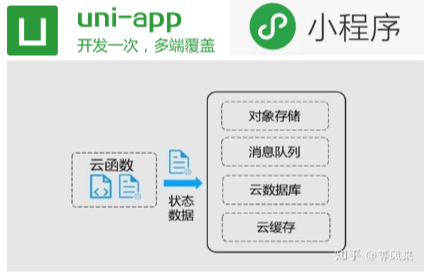
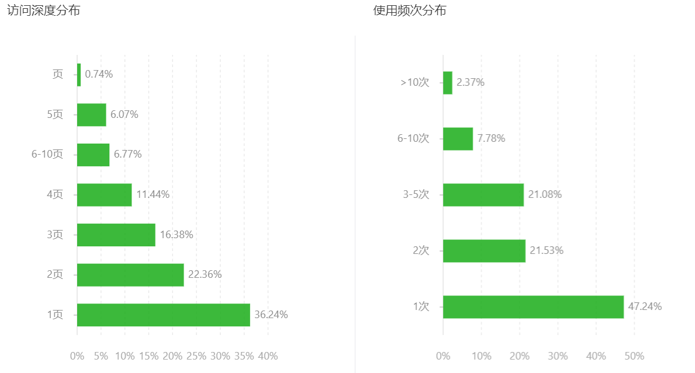
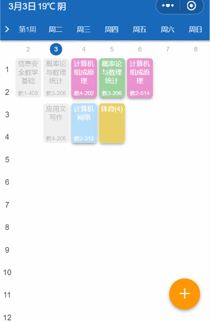
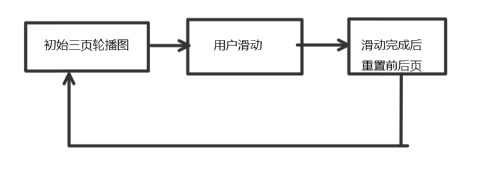
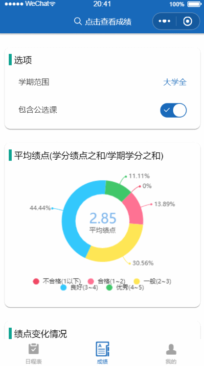

## 前端部分

前端主要完成在小程序载体上的数据展示，页面交互，接口对接等任务。

### 技术选型

前端部分采用`uniapp`编写代码，编译至小程序。同时部分后台采用了时下火热的云函数(serverless)技术。

###### 

#### `uniapp`

`uniapp`是由[Dcloud](https://uniapp.dcloud.io/README)出品的成熟的跨端解决方案，可以使用前端技术栈快速开发应用，降低开发成本。


>  `uni-app` 是一个使用 [Vue.js](https://vuejs.org/) 开发所有前端应用的框架，开发者编写一套代码，可发布到iOS、Android、H5、以及各种小程序（微信/支付宝/百度/头条/QQ/钉钉）等多个平台。 

项目并没有采用微信官方原生的编辑器，而是选用了`uniapp`进行开发。事实证明`uniapp`的选型是极为正确的。它有以下优点：

- **微信小程序的`api`功能不受限制**

`uniapp`采用的是静态模板编译方案，最终编译至小程序时，并未改变小程序的代码结构。这可以最大程度地保证小程序的功能完整和性能，同时，它可以兼容微信官方未来出现的任意`api`能力，保证了小程序功能上的可拓展性。

-  **可以使用浏览器进行调试** 

在开发中，我采用先编译至h5端，再编译至小程序段进行调整和发布。在使用微信模拟器开发，不支持热更新（无需重启整个应该，差量更新代码），大大降低了开发的效率，增加了开发和调试的成本；而使用浏览器开发，可以使用chrome上的开发插件，特别是Vue官方定制的开发插件 `vue-dev-tool`，  它可以查看 `v-node` 树 , 数据状态和 `Vuex` , 并可以热更新，相对于原生开发在开发体验和效率上是**降维打击**。 

#### 小程序

在应用入口的选型上，我们选择了小程序作为入口。

- 无需安装：小程序是内嵌于微信中的，使用过程中不需要下载、安装。
- 触手可及：用户通过扫码等形式直接进入小程序，实现线下场景与线上应用的即时联通。
- 用完即走：在线下场景中，有需要可以直接接入小程序，无需安装及订阅。
- 无需卸载：访问过小程序后可直接关闭，没有卸载过程。
- 需要随时打开：当你需要的时候在微信中有10大入口50个小入口让你随时找到它。

下面是小程序的统计数据



我们发现，用户一般只使用第一个页面（查看课程表），使用频次也不高，因此，小程序相对于传统app更适合作为应用的载体，完美地继承了小程序的各项优势。

#### 云函数

项目中，前端承载了部分后台开发，采用了云函数的解决方案

> 开发者可以使用云开发开发微信小程序、小游戏，无需搭建服务器，即可使用云端能力。
> 云开发为开发者提供完整的原生云端支持和微信服务支持，弱化后端和运维概念，无需搭建服务器，使用平台提供的 API 进行核心业务开发，即可实现快速上线和迭代，同时这一能力，同开发者已经使用的云服务相互兼容，并不互斥。

 云函数开发成本低，直接上传部署即可，每个云函数实现一个功能，适合功能的拆分，方便且极易维护。

### 功能部分

功能主要有以下几个模块

- **日程表模块**
- **成绩模块**
- **拓展模块**
- **个性化模块**
-  **登录模块**


#### 日程表模块

##### 轮播图

日程表展示一天的课程和自定义的日程信息，是应用中的最为核心的模块。它主要采用一个`swiper`（轮播图）组件来完成


在开发之初，我发现滑动卡顿的现象。经分析后发现，一个学期为20周，20周意味着将有20个轮播日程表，上千个节点，每次滑动牵一发即动全身，导致页面出现掉帧的现象。

于是我积极寻求解决方案，最终采用了**三页轮播的方案，此方案可以将无限页的轮播图缩减到为三页以节省性能开支。**



*gif有些许掉帧。*

最终效果滑动流畅，无卡顿现象。

三页轮播图细节如下



实现很简单，每次用户滑动后重置当前页的前后页，以错位的时空成本换取性能，这也是前端常用的按需加载的方案。

```
初始:
//list的项的数值代表第几页，这是一个循环队列
//current代表一个指针，表示当前是list中第几个项,此时list[current] == 0
list:0 1 19 
current:0

第一次右滑完成:
list:0 1 2
current:1

第二次右滑完成
list:3 1 2
current:2
```

current为0时，前页索引是2，后页索引是1；current为1时，前页索引是0，后页索引是2；current为2时，前页索引是1，后页索引是0。实际上这是一个长度为3的循环队列，前页的项的值比current的项的值少1，后页的项的值比current的项的值多1。

代码如下:

```javascript
//length为轮播图页数
const nowIndex = list[current];
list[(current + 1) % 3] = (nowIndex + 1) % length);
list[(current + 2) % 3] = (nowIndex - 1) % length);
```

三页轮播图在后续开发中经常复用以提升性能。

##### 弹框

在首页中放置了非常多的弹框组件，经过考量，发现弹框内容可以复用一个弹框组件且可以按需加载,。

```html
<modal ref="modal" :once="true" :z="allModal.modal.z">
        <view :class="modalType == 'classDetail' ? '' : 'display-none'">
            <class-detail-modal />
        </view>
        <plugin-background v-if="modalType == 'background'" />
        <time-picker v-else-if="modalType == 'timePicker'" />
        <plugin-notice v-else-if="modalType == 'notice'" />
        <repeat v-else-if="modalType == 'repeat'" />
        <ask v-else-if="modalType == 'ask'" />
        <QR v-else-if="modalType == 'QR'" />
		<payWarning v-else-if="modalType == 'pay'"/>
    </modal>
```

通过设置`modalType`的值来改变的弹框内容，同时，他们都在一个 `modal`组件之内，复合单例模式。

两项优化后，经测试，小程序的冷启动时间由4000ms左右降至2500ms以内，启动速度大大提升了40%。

#### 成绩模块

成绩是学生一个学期的学习成果的核心指标，学生最为关心的模块应该是绩点。在考察了众多其他学校的小程序后我们发现，成绩这个最为重要的模块，往往只是简单地列出成绩甚至是忽略。

于是，我们思考如何能使成绩直观地呈现给使用者，思考使用者更想了解成绩中什么相关的内容，决定项目中采用图表（[u-charts](https://gitee.com/uCharts/uCharts)）来展示成绩。



**平均绩点**是最为重要的指标，我们将它放在了第一项，它除了展示平均绩点外，还可以了解科目成绩的层次组成。后续的几个图表是对平均绩点的解释，分别是 **绩点变化情况，学分绩点排行，学科绩点排行。**使用者通过绩点变化情况可以了解自己各个学期绩点的升降；学分绩点是平均绩点的决定性因素，可以学科在总学分绩点中的贡献程度，以针对性地对不同的学科进行学习；学科绩点是单科的绩点，可以了解自己在某一科的学习情况。

日后也将会推出高学分学科推荐，同时与拓展功能中的文件系统结合，推送对应的学习资料等功能，使使用者有目的对不同科目进行学习。

### 拓展模块

拓展模块是实现各项便捷功能的模块，它与小程序主体耦合度低，可以拆分出独立的业务，以复用到不同的业务上。因为耦合度低，无侵入，它也可以随意地拓展不同的功能，现主要有以下功能：

- 入馆二维码
- 资料查询
- 垃圾分类查询
- 校园网查询
- 校园网缴费
- 图书馆检索
- 空教室查询
- 一键评教（开发中）
- 失物招领（开发中）
- 广工导览（开发中）

功能将不断被添加与完善。这些功能聚焦学生生活中的不便和痛点，提高学生的获取信息和处理事务的效率。

#### 资料查询

我们发现，学生在临近期末复习时，会寻找各科的资料，而资料分散在不同的平台上。我们期望可以推出一站式的服务，帮助使用者更高效地查找资料。

